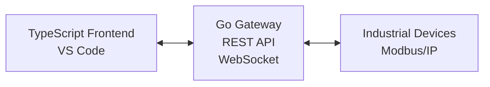

# Research: Standardize Diagram-Making Tools for Bifrost Documentation

## Problem Statement

The Bifrost project currently uses ASCII art diagrams in documentation (e.g., `bifrost_spec.md`), which while functional, have several limitations:
- Difficult to maintain and update
- Limited visual appeal for professional documentation
- Hard to version control effectively
- Not suitable for complex industrial automation diagrams
- Cannot be easily shared with non-technical stakeholders

## Objective

Research and select standardized diagram-making tools that:
1. **Integrate seamlessly with our GitHub workflow**
2. **Work well with VS Code development environment**
3. **Support version control** (diagram-as-code preferred)
4. **Create professional-quality technical diagrams**
5. **Support industrial automation and protocol diagrams**

## Current Documentation Needs

Based on analysis of `bifrost_spec.md` and project requirements, we need tools for:

### Technical Architecture Diagrams
- System architecture overviews
- Component relationship diagrams
- Data flow diagrams
- Network topology diagrams

### Industrial Automation Diagrams
- Protocol flow diagrams (Modbus, Ethernet/IP, OPC-UA)
- P&ID (Process & Instrumentation Diagrams)
- Ladder logic visualization
- Industrial network topologies

### Development Process Diagrams
- Sequence diagrams for API interactions
- Deployment architecture diagrams
- CI/CD pipeline visualizations
- Use case diagrams

## Research Findings

### Top Recommendations

#### 1. **Mermaid.js** ⭐⭐⭐⭐⭐ (Primary Choice)
**Why it's perfect for Bifrost:**
- **Native GitHub integration** - renders directly in README files
- **Version control friendly** - text-based diagrams
- **VS Code extension** available
- **Free and open source**
- **Easy syntax** for technical teams

**Example for replacing ASCII art:**


**Supported Diagram Types:**
- System architecture diagrams ✅
- Sequence diagrams ✅
- Component diagrams ✅
- Network flows ✅

#### 2. **PlantUML** ⭐⭐⭐⭐⭐ (Secondary Choice)
**Why it complements Mermaid:**
- **Comprehensive UML support** for detailed technical diagrams
- **Extensive customization** options
- **Integration with CI/CD** pipelines
- **Professional output quality**

**Best for:**
- Detailed component architecture
- Complex sequence diagrams
- Technical specifications
- Enterprise-level documentation

#### 3. **Eraser** ⭐⭐⭐⭐ (AI-Powered Alternative)
**Why it's valuable:**
- **AI-powered diagram generation** from text descriptions
- **Strong GitHub/VS Code integration**
- **Collaborative editing** capabilities
- **Multiple format export** (including Mermaid)

**Best for:**
- Rapid prototyping of system designs
- Converting text specifications to diagrams
- Collaborative design sessions

### Specialized Tools for Industrial Documentation

#### 4. **Lucidchart** ⭐⭐⭐⭐⭐ (Professional Industrial Diagrams)
**Why it's needed for industrial use:**
- **Professional P&ID capabilities**
- **Industry-standard symbols** for automation
- **High-quality output** for client presentations
- **Collaborative features** for team reviews

**Best for:**
- Industrial protocol diagrams
- P&ID documentation
- Professional client presentations
- Complex industrial automation workflows

## Implementation Strategy

### Phase 1: Replace ASCII Art (Immediate)
1. **Install Mermaid.js support** in repository
2. **Convert existing ASCII diagrams** in `bifrost_spec.md`
3. **Add VS Code extensions** for team productivity
4. **Create diagram templates** for common patterns

### Phase 2: Enhance Technical Documentation (1-2 weeks)
1. **Add PlantUML support** for detailed diagrams
2. **Create component architecture diagrams**
3. **Document API interactions** with sequence diagrams
4. **Standardize diagram styles** across project

### Phase 3: Professional Industrial Documentation (2-4 weeks)
1. **Evaluate Lucidchart** for industrial diagrams
2. **Create P&ID templates** for industrial protocols
3. **Develop ladder logic visualization** standards
4. **Create client-facing documentation** templates

### Phase 4: AI-Powered Workflow (Future)
1. **Integrate Eraser** for rapid prototyping
2. **Automate diagram generation** from code
3. **Create collaborative design** workflows
4. **Implement diagram validation** in CI/CD

## Technical Requirements

### GitHub Integration
- Diagrams should render natively in GitHub markdown
- Support for automated diagram generation in CI/CD
- Version control friendly formats (text-based preferred)

### VS Code Integration
- Preview capabilities for diagram editing
- Syntax highlighting for diagram code
- Live preview during editing
- Export capabilities to multiple formats

### Output Quality
- Professional-grade output suitable for:
  - Technical documentation
  - Client presentations
  - Industrial specifications
  - Academic publications

## Proposed Toolchain

### Primary Stack (Immediate Implementation)
```
Mermaid.js → System architecture, flows, basic diagrams
PlantUML → Detailed UML, component diagrams
GitHub → Native rendering, version control
VS Code → Development environment integration
```

### Professional Stack (Client-Facing)
```
Lucidchart → Industrial P&ID, professional diagrams
Eraser → AI-powered rapid prototyping
Export → PDF, PNG, SVG for presentations
```

### Required VS Code Extensions
- Mermaid Preview
- PlantUML
- Draw.io Integration
- Eraser
- Markdown Preview Enhanced

## Success Metrics

- **Replace all ASCII art** in documentation within 2 weeks
- **Standardize diagram creation** across all team members
- **Reduce diagram maintenance time** by 75%
- **Improve documentation quality** for client presentations
- **Enable collaborative diagram editing** workflows

## Budget Considerations

### Free Tools (Immediate Implementation)
- Mermaid.js - Free
- PlantUML - Free
- GitHub integration - Free
- VS Code extensions - Free

### Paid Tools (Professional Use)
- Lucidchart - $7.95-$9.00/user/month
- Eraser - Freemium model
- Professional industrial symbols - One-time cost

## Next Steps

1. **Get team approval** for toolchain selection
2. **Set up Mermaid.js** in repository
3. **Install VS Code extensions** for team
4. **Create first diagram** to replace ASCII art in `bifrost_spec.md`
5. **Establish diagram standards** and templates
6. **Train team** on new tools and workflows

## References

- [Mermaid.js Documentation](https://mermaid.js.org/)
- [PlantUML Documentation](https://plantuml.com/)
- [GitHub Mermaid Support](https://github.blog/2022-02-14-include-diagrams-markdown-files-mermaid/)
- [VS Code Diagram Extensions](https://marketplace.visualstudio.com/search?term=diagram&target=VSCode)

---

**Labels**: `documentation`, `tooling`, `diagrams`, `architecture`, `industrial-automation`
**Priority**: High
**Effort**: Medium
**Impact**: High