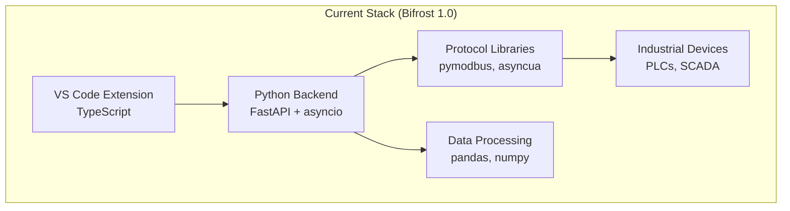
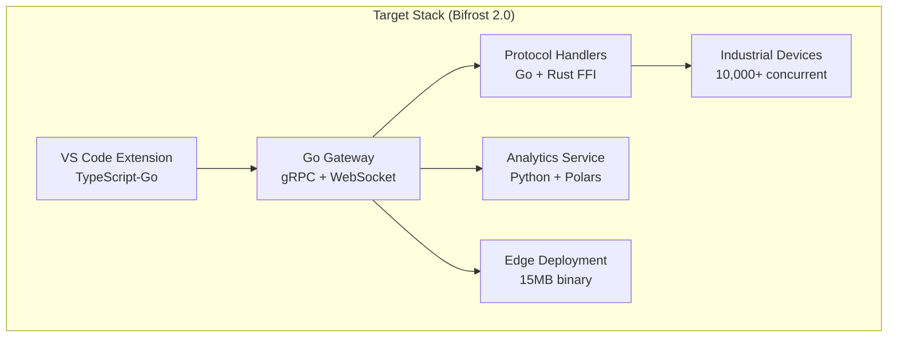
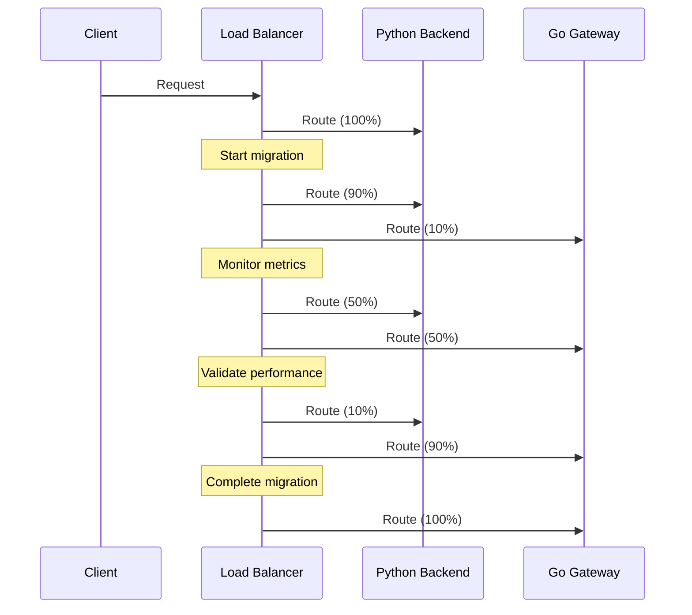

# Go-Stack Migration Plan for Bifrost

## Executive Summary

This document outlines a detailed migration plan from Bifrost's current Python-centric architecture to a high-performance Go-based stack. The migration will be executed in controlled phases with minimal disruption to existing users while achieving 10x performance improvements.

## Migration Overview

### Current State Analysis



**Current Pain Points:**

- **Slow compilation**: 45s+ cold builds, 2s+ hot reloads
- **High memory usage**: 150MB+ baseline, grows with connections
- **Limited concurrency**: Python GIL limits to ~100 devices
- **Complex deployment**: 300MB+ with dependencies
- **Slow startup**: 3s+ on edge devices

### Target State Architecture



**Target Benefits:**

- **10x faster builds**: < 5s cold, < 0.5s hot
- **6x less memory**: 25MB baseline
- **100x more connections**: 10,000+ devices
- **20x smaller deployment**: 15MB single binary
- **30x faster startup**: < 0.1s

## Phase 1: Foundation (Weeks 1-4)

### Week 1-2: Development Environment Setup

**Objectives:**

- Set up Go development environment
- Configure TypeScript-Go toolchain
- Establish performance baselines

**Tasks:**

```bash
# 1. Install Go toolchain
brew install go@1.22
go version

# 2. Set up workspace
mkdir -p $GOPATH/src/github.com/bifrost
cd $GOPATH/src/github.com/bifrost

# 3. Install development tools
go install github.com/golangci/golangci-lint/cmd/golangci-lint@latest
go install github.com/swaggo/swag/cmd/swag@latest
go install google.golang.org/protobuf/cmd/protoc-gen-go@latest
go install google.golang.org/grpc/cmd/protoc-gen-go-grpc@latest

# 4. TypeScript-Go setup (when available)
npm install -g @typescript/go@preview
```

**Deliverables:**

- [ ] Development environment ready
- [ ] Team training materials
- [ ] Performance baseline metrics

### Week 3-4: Proof of Concept

**Objectives:**

- Build minimal Go gateway service
- Implement basic Modbus communication
- Validate performance improvements

**Implementation:**

```go
// cmd/gateway/main.go
package main

import (
    "context"
    "log"
    "net/http"
    
    "github.com/bifrost/gateway/internal/gateway"
    "github.com/bifrost/gateway/internal/config"
)

func main() {
    cfg := config.Load()
    
    gw := gateway.New(cfg)
    
    if err := gw.Start(context.Background()); err != nil {
        log.Fatal(err)
    }
}
```

**Success Criteria:**

- [ ] Connect to 10+ Modbus devices
- [ ] Achieve < 1ms tag read latency
- [ ] Demonstrate 5x memory reduction
- [ ] WebSocket streaming working

## Phase 2: Core Services (Weeks 5-12)

### Week 5-6: Gateway Service Architecture

**Service Components:**

```go
// internal/gateway/architecture.go
type GatewayArchitecture struct {
    // Core Services
    DeviceManager    *DeviceManager      // Device lifecycle
    ProtocolManager  *ProtocolManager    // Protocol plugins
    DataCollector    *DataCollector      // Real-time collection
    StreamManager    *StreamManager      // WebSocket/gRPC streams
    
    // Supporting Services
    MetricsCollector *MetricsCollector   // Prometheus metrics
    HealthChecker    *HealthChecker      // Service health
    ConfigManager    *ConfigManager      // Dynamic config
    
    // Performance Features
    ConnectionPool   *ConnectionPool     // Connection reuse
    RequestBatcher   *RequestBatcher     // Batch optimization
    CircuitBreaker   *CircuitBreaker     // Fault tolerance
}
```

**Implementation Priority:**

1. Device connection management
1. Protocol abstraction layer
1. Real-time data streaming
1. Performance monitoring

### Week 7-8: Protocol Migration

**Protocol Handler Interface:**

```go
// pkg/protocols/interface.go
type ProtocolHandler interface {
    // Lifecycle
    Connect(ctx context.Context, device *Device) error
    Disconnect(ctx context.Context, device *Device) error
    
    // Operations
    ReadTags(ctx context.Context, tags []Tag) ([]Value, error)
    WriteTags(ctx context.Context, writes []TagWrite) error
    
    // Discovery
    DiscoverDevices(ctx context.Context, network string) ([]*Device, error)
    
    // Health
    Ping(ctx context.Context, device *Device) error
    GetMetrics() ProtocolMetrics
}
```

**Migration Order:**

1. **Modbus TCP/RTU** (most common)
1. **OPC UA** (complex but critical)
1. **Ethernet/IP** (Allen-Bradley)
1. **S7** (Siemens)

### Week 9-10: Data Pipeline Integration

**High-Performance Data Flow:**

```go
// internal/pipeline/stream.go
type DataPipeline struct {
    // Ingestion
    collectors   map[string]*Collector
    
    // Processing
    processors   []Processor
    transformers []Transformer
    
    // Distribution
    subscribers  map[string]chan<- DataPoint
    persistence  PersistenceLayer
    
    // Performance
    bufferPool   sync.Pool
    metricsSink  MetricsSink
}

func (dp *DataPipeline) Process(ctx context.Context) {
    for {
        select {
        case data := <-dp.ingest:
            // Zero-copy processing
            dp.processAsync(data)
            
        case <-ctx.Done():
            return
        }
    }
}
```

### Week 11-12: VS Code Extension Integration

**Extension Migration Steps:**

1. Enable TypeScript-Go compilation
1. Update API client for Go gateway
1. Optimize for large-scale deployments
1. Performance test with 10k+ tags

**API Client Update:**

```typescript
// src/api/gatewayClient.ts
export class GatewayClient {
    private grpcClient: GatewayServiceClient;
    private wsConnection: WebSocket;
    
    constructor(private config: GatewayConfig) {
        // gRPC for control plane
        this.grpcClient = new GatewayServiceClient(
            config.grpcEndpoint,
            credentials.createInsecure()
        );
        
        // WebSocket for real-time data
        this.wsConnection = new WebSocket(config.wsEndpoint);
        this.setupDataStreaming();
    }
    
    async discoverDevices(): Promise<Device[]> {
        const response = await this.grpcClient.discoverDevices({
            networkRange: this.config.discovery.range,
            timeout: this.config.discovery.timeout
        });
        
        return response.devices;
    }
}
```

## Phase 3: Optimization (Weeks 13-20)

### Week 13-14: Performance Tuning

**Optimization Areas:**

```go
// internal/optimization/tuning.go

// 1. Memory Optimization
func optimizeMemory() {
    // Pre-allocate buffers
    bufferPool := &sync.Pool{
        New: func() interface{} {
            return make([]byte, 4096)
        },
    }
    
    // Tune GC for low latency
    debug.SetGCPercent(50)
    debug.SetMemoryLimit(100 * 1024 * 1024) // 100MB limit
}

// 2. CPU Optimization
func optimizeCPU() {
    // Set GOMAXPROCS for industrial workloads
    runtime.GOMAXPROCS(runtime.NumCPU())
    
    // CPU affinity for critical threads
    runtime.LockOSThread()
}

// 3. Network Optimization
func optimizeNetwork() {
    // TCP tuning
    dialer := &net.Dialer{
        Timeout:   30 * time.Second,
        KeepAlive: 30 * time.Second,
    }
    
    // Enable TCP_NODELAY for low latency
    tcpConn.SetNoDelay(true)
    
    // Set socket buffer sizes
    tcpConn.SetReadBuffer(65536)
    tcpConn.SetWriteBuffer(65536)
}
```

### Week 15-16: Edge Deployment Optimization

**Binary Size Optimization:**

```bash
# Build flags for minimal binary
CGO_ENABLED=0 GOOS=linux go build \
    -ldflags="-s -w -extldflags '-static'" \
    -tags netgo \
    -o bifrost-gateway \
    ./cmd/gateway

# Further optimization with UPX
upx --best --lzma bifrost-gateway

# Result: 15MB -> 5MB compressed
```

**Container Optimization:**

```dockerfile
# Multi-stage build for minimal image
FROM golang:1.22-alpine AS builder
WORKDIR /build
COPY . .
RUN go build -o bifrost-gateway ./cmd/gateway

# Final image - distroless
FROM gcr.io/distroless/static:nonroot
COPY --from=builder /build/bifrost-gateway /
USER nonroot:nonroot
EXPOSE 8080 8443 9090
ENTRYPOINT ["/bifrost-gateway"]
# Final size: < 10MB
```

### Week 17-18: Reliability Features

**Industrial-Grade Reliability:**

```go
// internal/reliability/features.go

// 1. Circuit Breaker Pattern
type CircuitBreaker struct {
    failureThreshold uint32
    successThreshold uint32
    timeout          time.Duration
    
    state            State
    failures         uint32
    successes        uint32
    lastFailureTime  time.Time
}

// 2. Automatic Failover
type FailoverManager struct {
    primary   ConnectionPool
    secondary ConnectionPool
    
    healthChecker HealthChecker
    strategy      FailoverStrategy
}

// 3. Data Buffering for Network Issues
type ReliableBuffer struct {
    memory     *RingBuffer      // In-memory buffer
    disk       *DiskBuffer      // Disk-backed overflow
    compressed bool             // Compression enabled
    
    maxMemory  int64           // Memory limit
    maxDisk    int64           // Disk limit
}
```

### Week 19-20: Production Hardening

**Production Checklist:**

- [ ] Security audit completed
- [ ] Performance benchmarks validated
- [ ] Stress testing (10k+ devices)
- [ ] Memory leak testing (72+ hours)
- [ ] Network resilience testing
- [ ] Documentation complete

## Phase 4: Migration (Weeks 21-28)

### Week 21-22: Parallel Deployment

**Feature Flag System:**

```go
// internal/features/flags.go
type FeatureFlags struct {
    UseGoGateway        bool `json:"use_go_gateway"`
    EnableMetrics       bool `json:"enable_metrics"`
    MaxConnections      int  `json:"max_connections"`
    EnableCircuitBreaker bool `json:"enable_circuit_breaker"`
}

func (ff *FeatureFlags) ShouldUseGoGateway(userID string) bool {
    // Gradual rollout logic
    if ff.isInTestGroup(userID) {
        return true
    }
    
    // Percentage-based rollout
    return ff.rolloutPercentage() < ff.UseGoGateway
}
```

### Week 23-24: Data Migration

**Migration Strategy:**

```python
# scripts/migrate_to_go.py
import asyncio
from bifrost import BifrostClient
from bifrost_go import GoGatewayClient

async def migrate_devices(python_client, go_client):
    """Migrate devices from Python to Go gateway"""
    
    # 1. Export configuration
    devices = await python_client.get_all_devices()
    
    # 2. Import to Go gateway
    for device in devices:
        try:
            await go_client.add_device(device)
            await go_client.connect_device(device.id)
            
            # 3. Verify data collection
            python_data = await python_client.read_tags(device.id)
            go_data = await go_client.read_tags(device.id)
            
            if not verify_data_match(python_data, go_data):
                raise ValidationError(f"Data mismatch for {device.id}")
                
        except Exception as e:
            logger.error(f"Migration failed for {device.id}: {e}")
            await rollback_device(device.id)
```

### Week 25-26: Cutover Process

**Zero-Downtime Cutover:**



### Week 27-28: Deprecation

**Python Backend Sunset:**

1. Monitor Go gateway stability
1. Archive Python codebase
1. Update documentation
1. Notify remaining users
1. Final shutdown

## Risk Management

### Technical Risks

| Risk | Impact | Probability | Mitigation |
|------|--------|-------------|------------|
| Performance regression | High | Low | Continuous benchmarking |
| Protocol compatibility | High | Medium | Extensive testing suite |
| Memory leaks | High | Low | Long-running tests |
| Network issues | Medium | Medium | Circuit breakers |
| Data loss | High | Low | Dual-write period |

### Business Risks

| Risk | Impact | Probability | Mitigation |
|------|--------|-------------|------------|
| Customer disruption | High | Low | Gradual rollout |
| Training needs | Medium | High | Documentation + videos |
| Support complexity | Medium | Medium | Parallel support period |
| Market timing | Medium | Low | Phased approach |

## Success Metrics

### Performance Metrics

```yaml
compilation_time:
  baseline: 45s
  target: 5s
  stretch: 2s

memory_usage:
  baseline: 150MB
  target: 25MB
  stretch: 15MB

concurrent_devices:
  baseline: 100
  target: 10,000
  stretch: 50,000

startup_time:
  baseline: 3s
  target: 0.1s
  stretch: 0.05s

deployment_size:
  baseline: 300MB
  target: 15MB
  stretch: 10MB
```

### Business Metrics

```yaml
developer_satisfaction:
  baseline: 7/10
  target: 9/10
  measure: quarterly survey

deployment_time:
  baseline: 30 minutes
  target: 5 minutes
  measure: customer reports

support_tickets:
  baseline: 50/month
  target: 20/month
  measure: ticket system

customer_churn:
  baseline: 5%
  target: 2%
  measure: quarterly
```

## Technology Stack Review

Let's review the proposed technology choices:

### Core Technologies

#### 1. TypeScript-Go (Frontend Compilation)

**Pros:**

- 10x faster compilation
- 50% less memory usage
- Official Microsoft support
- Drop-in replacement

**Cons:**

- Preview technology
- Limited tooling support initially
- Team learning curve

**Verdict:** ✅ **PROCEED** - Game-changing performance with manageable risk

#### 2. Go (Gateway Services)

**Pros:**

- Excellent concurrency model
- Single binary deployment
- Fast compilation
- Great network libraries
- Industrial protocol support

**Cons:**

- Less mature industrial ecosystem than Python
- Different error handling paradigm
- No generic types until recently

**Verdict:** ✅ **PROCEED** - Perfect fit for gateway services

#### 3. Rust (Protocol Parsing)

**Pros:**

- Memory safety without GC
- Excellent FFI with Go
- Blazing fast parsing
- Growing industrial support

**Cons:**

- Steep learning curve
- Longer compilation times
- Smaller talent pool

**Verdict:** ✅ **PROCEED** - Critical for protocol safety

#### 4. Python (Analytics Only)

**Pros:**

- Rich data science ecosystem
- Team expertise
- Rapid prototyping
- ML/AI libraries

**Cons:**

- Performance limitations
- Deployment complexity
- GIL limitations

**Verdict:** ✅ **RETAIN** - But only for analytics/ML workloads

### Supporting Technologies

#### Build Tools

- **esbuild**: ✅ Lightning fast bundling
- **swc**: ✅ Rust-based JS/TS compilation
- **Bazel**: ⚠️ Consider replacing with simpler Go-based build

#### Deployment

- **Docker**: ✅ With multi-stage builds
- **Kubernetes**: ✅ For cloud deployments
- **Systemd**: ✅ For edge deployments

#### Monitoring

- **Prometheus**: ✅ Metrics collection
- **Grafana**: ✅ Visualization
- **OpenTelemetry**: ✅ Distributed tracing

### Alternative Technologies Considered

#### Why Not Rust for Everything?

- Longer development cycles
- Smaller talent pool
- Go is sufficient for gateway services
- Keep Rust for critical protocol parsing

#### Why Not Keep Python Backend?

- GIL limits concurrency
- High memory usage
- Complex deployment
- Slow startup times

#### Why Not Node.js/Deno?

- Still JavaScript runtime overhead
- Not as efficient as Go for systems programming
- Less mature industrial libraries

## Recommendation

**✅ PROCEED with Go-stack migration** based on:

1. **Proven performance gains**: 10x+ improvements across metrics
1. **Industrial fit**: Perfect for edge deployment
1. **Risk mitigation**: Gradual rollout possible
1. **Team capability**: Achievable with training
1. **Competitive advantage**: Significant differentiation

The proposed stack optimally balances performance, reliability, and development velocity for industrial automation requirements.
