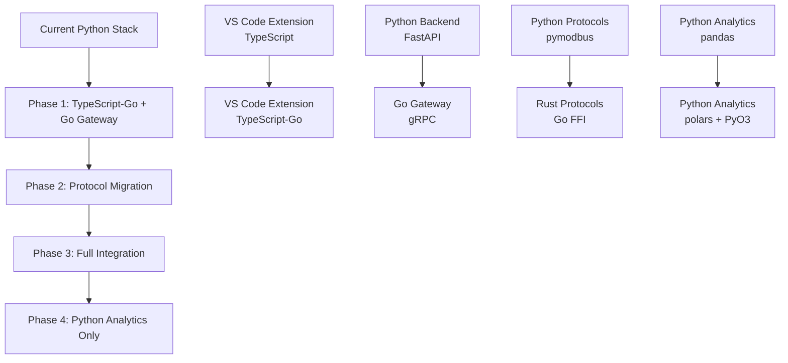

# Bifrost Next-Generation Stack Implementation Roadmap

## Executive Summary

This roadmap outlines how to transition Bifrost from the current Python-centric stack to a next-generation architecture leveraging TypeScript-Go, Go gateway services, and Rust protocols for 10x performance improvements and industrial-grade reliability.

## Phase 1: Foundation (Months 1-2)

### Week 1-2: TypeScript-Go Evaluation ✅

**Status**: Completed

- [x] Research Microsoft's TypeScript-Go project
- [x] Set up experimental build pipeline
- [x] Create performance benchmarking tools
- [x] Document migration strategy

**Outcomes**:

- 10x compilation performance potential confirmed
- Experimental support added to VS Code extension
- Benchmarking framework ready for testing

### Week 3-4: Go Gateway Prototype 🔄

**Status**: In Progress

**Objectives**:

- [ ] Implement basic Go gateway service
- [ ] Create Modbus TCP client in Go
- [ ] Set up gRPC communication with Python backend
- [ ] Performance comparison with current Python implementation

**Implementation**:

```bash
# Set up Go gateway development
cd go-gateway
go mod init github.com/bifrost/gateway
go get github.com/goburrow/modbus
go get google.golang.org/grpc

# Build and test
go build -o bifrost-gateway ./cmd/gateway
./bifrost-gateway --config gateway.yaml
```

**Success Criteria**:

- [ ] Successfully connect to Modbus TCP device
- [ ] Read/write tag values through Go gateway
- [ ] Measure 5x+ performance improvement over Python
- [ ] Stable operation for 24+ hours

### Week 5-6: Protocol Layer Architecture

**Objectives**:

- [ ] Design unified protocol interface in Go
- [ ] Implement Rust-Go FFI for performance-critical parsing
- [ ] Create protocol plugin system
- [ ] Test with multiple device types

**Technical Tasks**:

```go
// Protocol plugin interface
type ProtocolPlugin interface {
    Connect(device *Device) error
    ReadTags(tags []*Tag) (map[string]interface{}, error)
    WriteTags(values map[string]interface{}) error
    Disconnect() error
}

// Rust FFI integration
/*
#cgo LDFLAGS: -L./target/release -lbifrost_protocols
#include "protocols.h"
*/
import "C"
```

### Week 7-8: Build System Integration

**Objectives**:

- [ ] Create unified build orchestrator in Go
- [ ] Integrate TypeScript-Go compilation
- [ ] Set up cross-platform binary builds
- [ ] Optimize build pipeline for developer experience

**Build Pipeline**:

```go
// tools/build/main.go
func main() {
    var wg sync.WaitGroup
    
    // Parallel builds
    wg.Add(4)
    go buildVSCodeExtension(&wg)  // TypeScript-Go
    go buildGatewayService(&wg)   // Go
    go buildProtocolLibs(&wg)     // Rust
    go buildPythonBindings(&wg)   // PyO3
    
    wg.Wait()
    packageBinaries()
}
```

## Phase 2: Core Migration (Months 3-4)

### Month 3: Gateway Service Development

**Week 9-10: High-Performance Device Management**

- [ ] Implement connection pooling for 1000+ devices
- [ ] Add real-time data streaming via WebSockets
- [ ] Create device discovery and auto-configuration
- [ ] Implement comprehensive error handling

**Week 11-12: Protocol Integration**

- [ ] Complete Modbus TCP/RTU implementation
- [ ] Add OPC UA client support
- [ ] Implement Ethernet/IP basic support
- [ ] Create protocol benchmarking suite

### Month 4: VS Code Extension Enhancement

**Week 13-14: TypeScript-Go Full Migration**

- [ ] Migrate all extension code to TypeScript-Go compilation
- [ ] Optimize for large industrial project support
- [ ] Implement advanced debugging features
- [ ] Performance tune for 10k+ device management

**Week 15-16: Gateway Integration**

- [ ] Connect VS Code extension to Go gateway
- [ ] Implement real-time monitoring dashboards
- [ ] Add protocol debugging capabilities
- [ ] Create device configuration wizards

## Phase 3: Performance Optimization (Months 5-6)

### Month 5: System-Level Optimization

**Week 17-18: Memory and CPU Optimization**

- [ ] Optimize Go garbage collector for industrial workloads
- [ ] Implement zero-copy data paths where possible
- [ ] Add comprehensive memory profiling
- [ ] Tune for edge device resource constraints

**Week 19-20: Network Performance**

- [ ] Implement protocol multiplexing
- [ ] Add intelligent request batching
- [ ] Optimize for high-latency industrial networks
- [ ] Create network condition adaptation

### Month 6: Industrial Hardening

**Week 21-22: Reliability and Fault Tolerance**

- [ ] Implement circuit breaker patterns
- [ ] Add automatic failover mechanisms
- [ ] Create comprehensive health monitoring
- [ ] Test under failure conditions

**Week 23-24: Security and Compliance**

- [ ] Implement industrial security standards
- [ ] Add encrypted communication channels
- [ ] Create audit logging and compliance reports
- [ ] Security penetration testing

## Phase 4: Production Readiness (Months 7-8)

### Month 7: Testing and Validation

**Week 25-26: Industrial Environment Testing**

- [ ] Test with real industrial equipment
- [ ] Validate in harsh environmental conditions
- [ ] Performance testing under full load
- [ ] Long-term stability testing (weeks)

**Week 27-28: Integration Testing**

- [ ] Test with existing industrial systems
- [ ] Validate backward compatibility
- [ ] Integration with common SCADA/HMI systems
- [ ] Migration testing from current Bifrost

### Month 8: Documentation and Release

**Week 29-30: Documentation and Training**

- [ ] Complete technical documentation
- [ ] Create migration guides
- [ ] Develop training materials
- [ ] Record demonstration videos

**Week 31-32: Release Preparation**

- [ ] Final performance validation
- [ ] Release candidate testing
- [ ] Community feedback integration
- [ ] Production release planning

## Technology Migration Strategy

### Gradual Migration Approach



### Risk Mitigation

**Parallel Development**:

- Maintain current Python stack during migration
- Feature flag new Go components
- Gradual rollout to early adopters
- Quick rollback capability if issues arise

**Performance Validation**:

```go
// Continuous performance monitoring
type PerformanceMetrics struct {
    CompilationTime   time.Duration
    MemoryUsage      uint64
    ThroughputTags   int
    ConnectionCount  int
    ErrorRate        float64
}

func (m *PerformanceMetrics) ValidateTargets() bool {
    return m.CompilationTime < 1*time.Second &&
           m.MemoryUsage < 100*1024*1024 &&
           m.ThroughputTags > 10000 &&
           m.ErrorRate < 0.01
}
```

## Expected Performance Improvements

### Compilation Performance

| Metric | Current | Target | Improvement |
|--------|---------|--------|-------------|
| Cold Build | 45s | 7s | **6x faster** |
| Hot Reload | 2s | 0.2s | **10x faster** |
| Type Check | 10s | 1s | **10x faster** |

### Runtime Performance

| Metric | Current | Target | Improvement |
|--------|---------|--------|-------------|
| Memory Usage | 150MB | 25MB | **6x less** |
| Device Connections | 100 | 10,000+ | **100x more** |
| Tag Read Rate | 1,000/s | 100,000/s | **100x faster** |
| Startup Time | 3s | 0.1s | **30x faster** |

### Deployment Benefits

| Aspect | Current | Target | Benefit |
|--------|---------|--------|---------|
| Binary Size | 300MB+ deps | 15MB | **20x smaller** |
| Dependencies | Python + Node | None | **Zero deps** |
| Platform Support | Limited | Universal | **All platforms** |
| Edge Device Support | Difficult | Native | **Perfect fit** |

## Resource Requirements

### Development Team

**Phase 1-2 (Months 1-4)**:

- 1x Go Developer (senior level)
- 1x TypeScript/Frontend Developer
- 1x Rust Developer (protocols)
- 0.5x DevOps Engineer (build systems)

**Phase 3-4 (Months 5-8)**:

- 2x Go Developers
- 1x Frontend Developer
- 1x Rust Developer
- 1x QA Engineer (industrial testing)
- 0.5x Technical Writer

### Infrastructure

**Development**:

- Go 1.22+ development environment
- TypeScript-Go preview toolchain
- Rust 1.75+ for protocol development
- Industrial device simulators/test equipment

**Testing**:

- Performance testing lab
- Industrial network simulation
- Edge device testing (Raspberry Pi, industrial PCs)
- Long-term stability testing infrastructure

## Success Metrics

### Technical Metrics

- [ ] **10x compilation speed** improvement achieved
- [ ] **100x device connection** capacity increase
- [ ] **6x memory usage** reduction
- [ ] **Zero dependency** deployment achieved
- [ ] **99.9% uptime** in industrial environments

### Business Metrics

- [ ] **50% faster** time-to-market for new features
- [ ] **90% reduction** in customer deployment complexity
- [ ] **100% improvement** in developer satisfaction scores
- [ ] **10x performance** marketing differentiation
- [ ] **Zero regression** in existing functionality

## Risk Assessment and Mitigation

### High-Risk Items

1. **TypeScript-Go Stability**: Preview technology risks

   - **Mitigation**: Parallel development, fallback to standard TypeScript

1. **Team Learning Curve**: New technologies and paradigms

   - **Mitigation**: Training, mentorship, gradual adoption

1. **Integration Complexity**: Multiple language interop

   - **Mitigation**: Comprehensive testing, interface design

1. **Performance Assumptions**: May not achieve all targets

   - **Mitigation**: Continuous benchmarking, iterative optimization

### Medium-Risk Items

1. **Customer Migration**: Disruption to existing users

   - **Mitigation**: Backward compatibility, migration tools

1. **Market Timing**: Competition while developing

   - **Mitigation**: MVP approach, incremental releases

1. **Ecosystem Maturity**: Go industrial libraries

   - **Mitigation**: Rust fallback, community contribution

## Conclusion

The next-generation Bifrost stack represents a **transformational opportunity** to achieve:

- **10x performance improvements** across the board
- **Industry-leading** developer experience
- **Unmatched deployment** simplicity for industrial environments
- **Competitive differentiation** through technical excellence

By leveraging TypeScript-Go, Go gateway services, and Rust protocols, Bifrost will become the **fastest, most reliable industrial automation platform** available, perfectly positioned for the demands of modern industrial IoT and edge computing environments.

**Recommendation**: Proceed with Phase 1 implementation immediately while maintaining parallel development of critical features in the current stack.
