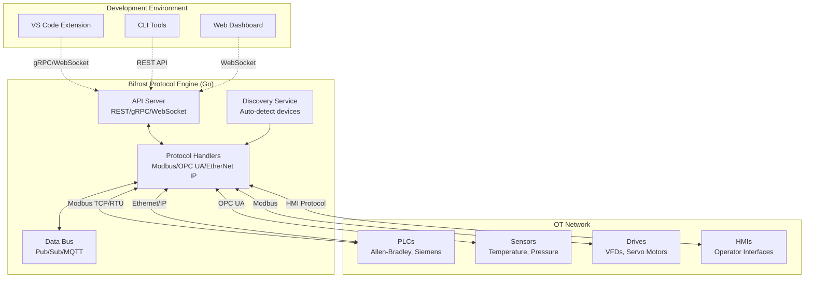
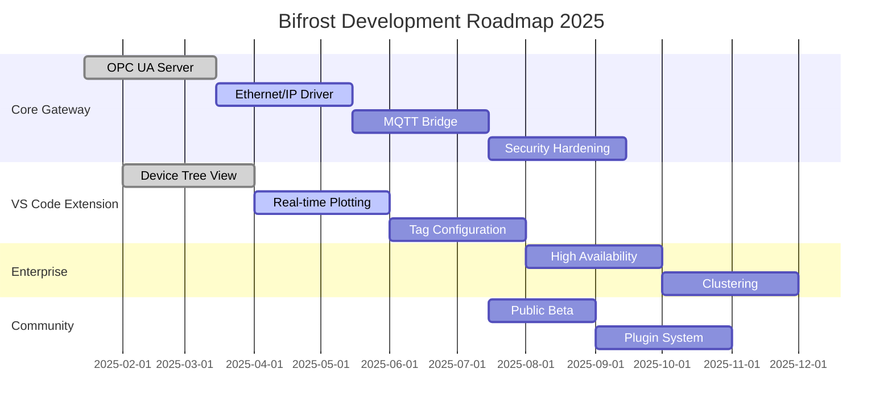

# 🌉 Bifrost - Automation Software Engineering Suite

**Bifrost** is a comprehensive automation software engineering suite that bridges operational technology (OT) with information technology (IT), providing developers with modern tools to build, deploy, and maintain industrial automation solutions. Build automation solutions with the same ease as web applications.

[](https://golang.org)
[](LICENSE)
[](https://github.com/your-org/bifrost/actions)
[](https://hub.docker.com/r/bifrost/gateway)

## 🏆 Core Features

- **High-Performance Protocol Engine**: Achieves 18,879 ops/sec with 53µs latency.
- **Protocol Support**: Native Modbus TCP/RTU, with OPC UA and others in development.
- **Modern Development Platform**: RESTful APIs, WebSocket streaming, and integrated development environment.
- **Cross-Platform**: Single binary deployment for Windows, Linux, and macOS.
- **Integrated Development Environment**: VS Code extension for automation engineering with real-time monitoring.

## 💡 Architecture

The architecture separates concerns between the high-performance protocol engine and the integrated development environment, ensuring optimal performance while providing excellent developer experience for automation engineering.



## 🗺️ Development Roadmap

Our roadmap focuses on expanding protocol support, enhancing developer tools, and strengthening enterprise features.



## 🚀 Quick Start

### Prerequisites

- **Go 1.22+** for gateway development
- **Node.js 18+** for VS Code extension development
- **Docker** (optional) for containerized deployment
- **Bazel** (optional) for advanced build management

### 1. Install and Run the Gateway

#### Option A: Pre-built Binary

```bash
# Download latest release
curl -L https://github.com/your-org/bifrost/releases/latest/download/bifrost-linux-amd64.tar.gz | tar xz
./bifrost-gateway --help
```

#### Option B: Build from Source

```bash
# Clone the repository
git clone https://github.com/your-org/bifrost.git
cd bifrost

# Build and run the gateway
go run ./cmd/gateway
```

#### Option C: Docker

```bash
# Run with Docker
docker run -p 8080:8080 -p 502:502 bifrost/gateway:latest

# Or with docker-compose
docker-compose up -d
```

### 2. Install the VS Code Extension

#### From VS Code Marketplace

1. Open VS Code
2. Go to Extensions (Ctrl+Shift+X)
3. Search for "Bifrost Industrial IoT"
4. Click "Install"

#### From VSIX File

```bash
# Build the extension
npm run build:extension
code --install-extension bifrost-*.vsix
```

### 3. Connect to Your First Device

1. **Start a Modbus Simulator** (for testing):

   ```bash
   # Python simulator (included)
   python virtual-devices/modbus-tcp-sim/modbus_server.py

   # Or use any Modbus TCP simulator on port 502
   ```

2. **Use the CLI for Quick Discovery**:

   ```bash
   # Discover devices on your network
   ./bifrost-cli discover --network 192.168.1.0/24

   # Quick Modbus scan
   ./bifrost-cli scan-modbus --timeout 1.0
   ```

3. **Use the VS Code Extension**:
   - Open the Bifrost panel in VS Code
   - Click "Add Device"
   - Enter device IP and select protocol (Modbus TCP)
   - Start monitoring real-time data

## 🛠️ Build System Commands

This project uses multiple build systems to support different components and deployment scenarios.

### 🏗️ Bazel Build System (Recommended for Python packages)

Bifrost uses Bazel for efficient, incremental builds of Python packages:

```bash
# Build all Python packages
just build

# Build specific package
just build-pkg bifrost-core
just build-pkg bifrost

# Build distribution wheels
just build-wheels

# Run all tests
just test

# Run tests for specific package
just test-pkg bifrost

# Clean Bazel cache
just clean-bazel

# Query dependencies
just deps //packages/bifrost:bifrost
just rdeps //packages/bifrost-core:bifrost_core

# Build performance analysis
just profile
```

**Direct Bazel commands:**
```bash
bazel build //packages/...           # Build all packages
bazel test //packages/...            # Run all tests
bazel build //packages/...:wheel     # Build distribution wheels
bazel query "deps(//packages/...)"   # Analyze dependencies
```

See [docs/bazel-build-system.md](docs/bazel-build-system.md) for complete documentation.

### ⚡ Quick Quality Checks

For rapid feedback during development:

```bash
# Super quick check (30 seconds) - Essential issues only
just quick        # or make quick
./scripts/quick-check.sh

# Standard check - Format + lint + type check
just check        # or make check

# Comprehensive check - Full analysis with detailed report
just check-all    # or make check-all
./scripts/check-all.sh
```

**Example Output:**

```
🌉 Bifrost Quick Quality Check
==============================

📝 Formatting Check
→ Checking Go formatting
✅ Go code properly formatted
→ Checking Python formatting  
✅ Python code properly formatted

🔍 Linting
→ Linting Go code
✅ Go linting passed
→ Linting Python code
⚠️  Python linting issues found

📊 Quick Check Summary
======================
Status:    0 errors, 2 warnings
Duration:  1s

⚠️  Consider addressing 2 warnings
💡 Run 'just check-all' for detailed analysis
```

### 🎯 Command Comparison

| Command | Duration | Coverage | Use Case |
|---------|----------|----------|----------|
| `just quick` | ~30s | Essential checks | 🚀 Pre-commit, rapid feedback |
| `just check` | ~45s | Format + lint + types | 🔄 Development iteration |
| `just check-all` | ~3m | Full analysis + tests | 🔍 Pre-PR, comprehensive review |
| `just ci` | ~5m | Complete CI pipeline | 🚢 Release preparation |

### 🛠️ Available Task Runners

Choose your preferred task runner:

```bash
# Just (recommended) - Modern task runner
just quick          # Fast quality check
just dev           # Complete development workflow
just --list        # Show all commands

# Make - Traditional build system  
make quick         # Fast quality check
make dev          # Complete development workflow
make help         # Show all commands

# Direct script execution
./scripts/quick-check.sh      # Fast quality check
./scripts/check-all.sh        # Comprehensive analysis
```

### Go Gateway Commands

```bash
# Development workflow
go mod tidy                    # Update dependencies
go run ./cmd/gateway          # Run gateway in development mode
go build ./cmd/gateway        # Build binary
go test ./...                 # Run all tests
go test -race ./...           # Run tests with race detection

# Advanced builds
CGO_ENABLED=0 GOOS=linux go build -a -installsuffix cgo ./cmd/gateway
go build -ldflags "-X main.version=$(git describe --tags)" ./cmd/gateway

# Cross-platform builds
GOOS=windows GOARCH=amd64 go build ./cmd/gateway  # Windows
GOOS=darwin GOARCH=amd64 go build ./cmd/gateway   # macOS Intel
GOOS=darwin GOARCH=arm64 go build ./cmd/gateway   # macOS Apple Silicon
GOOS=linux GOARCH=arm64 go build ./cmd/gateway    # Linux ARM64
```

### Python Package Commands

```bash
# Set up Python development environment
python -m venv venv
source venv/bin/activate  # Windows: venv\Scripts\activate
pip install -e packages/bifrost-core[dev]
pip install -e packages/bifrost[dev]

# Run Python components
python -m bifrost.cli discover                    # CLI discovery
python packages/bifrost/src/bifrost/cli.py       # Direct CLI
python virtual-devices/modbus-tcp-sim/modbus_server.py  # Test server

# Testing and quality
pytest packages/bifrost/tests/               # Run tests
pytest --cov=bifrost packages/bifrost/tests/ # With coverage
ruff check packages/                         # Linting
ruff format packages/                        # Formatting
mypy packages/bifrost/src/                   # Type checking
```

### VS Code Extension Build Commands

The VS Code extension is built using Node.js and TypeScript.

```bash
# Navigate to extension directory
cd vscode-extension/

# Install dependencies
npm install

# Development builds
npm run compile                    # Compile TypeScript
npm run watch                     # Watch mode for development
npm run lint                      # ESLint checking
npm run format                    # Prettier formatting

# Extension packaging
npm run package                   # Create .vsix package
npm run package:release          # Release build with optimization

# Publishing (maintainers only)
npm run publish                   # Publish to VS Code Marketplace
npm run publish:ovsx             # Publish to Open VSX Registry

# Testing
npm test                          # Run extension tests
npm run test:integration         # Integration tests with VS Code

# Development with VS Code
code .                           # Open in VS Code
# Press F5 to launch Extension Development Host
```

### Docker and Container Commands

```bash
# Build Docker images
docker build -t bifrost/gateway .
docker build -f Dockerfile.dev -t bifrost/gateway:dev .

# Multi-architecture builds
docker buildx create --use
docker buildx build --platform linux/amd64,linux/arm64 -t bifrost/gateway:latest --push .

# Development with Docker Compose
docker-compose up -d                    # Start all services
docker-compose up gateway              # Start only gateway
docker-compose logs -f gateway         # Follow gateway logs
docker-compose down                     # Stop and remove containers

# Production deployment
docker stack deploy -c docker-stack.yml bifrost
kubectl apply -f k8s/                  # Kubernetes deployment
```

### Bazel Build Commands (Advanced)

For large-scale development and complex build requirements:

```bash
# Install Bazel (if not already installed)
# macOS: brew install bazel
# Ubuntu: apt install bazel
# Windows: choco install bazel

# Basic Bazel commands
bazel build //...                      # Build everything
bazel test //...                       # Run all tests
bazel run //cmd/gateway:gateway        # Run the gateway
bazel run //packages/bifrost:cli       # Run Python CLI

# Specific targets
bazel build //cmd/gateway:gateway      # Build Go gateway
bazel build //vscode-extension:package # Build VS Code extension
bazel test //packages/bifrost:tests    # Run Python tests

# Cross-compilation with Bazel
bazel build --platforms=@io_bazel_rules_go//go/toolchain:linux_amd64 //cmd/gateway
bazel build --platforms=@io_bazel_rules_go//go/toolchain:windows_amd64 //cmd/gateway

# Container builds
bazel run //cmd/gateway:image          # Build and load Docker image
bazel run //cmd/gateway:image.push     # Build and push to registry
```

### Just Task Runner Commands

For simplified development workflow (requires `just` command runner):

```bash
# Install just task runner
# macOS: brew install just
# Cargo: cargo install just
# See: https://github.com/casey/just

# Development workflow
just dev                     # Format, lint, test everything
just build                   # Build all components
just test                    # Run all tests
just run                     # Build and run gateway

# Individual tasks
just fmt                     # Format all code
just lint                    # Lint all code
just clean                   # Clean build artifacts

# Platform-specific builds
just build-linux             # Build for Linux
just build-windows           # Build for Windows
just build-darwin            # Build for macOS

# Docker operations
just docker-build           # Build Docker images
just docker-run             # Run with Docker Compose
just docker-push            # Push to registry

# VS Code extension
just ext-build               # Build extension
just ext-package             # Package extension
just ext-install             # Install locally

# Development setup
just dev-setup               # Install all development tools
just deps                    # Update all dependencies
```

## 🧪 Testing and Quality Assurance

### Running Tests

```bash
# Go tests
go test ./...                           # All Go tests
go test -v ./pkg/modbus                # Specific package with verbose output
go test -race -cover ./...             # With race detection and coverage
go test -bench=. ./pkg/performance     # Benchmark tests

# Python tests
pytest packages/bifrost/tests/         # Python unit tests
pytest --integration                   # Integration tests
pytest --benchmark                     # Performance benchmarks

# End-to-end tests
./scripts/e2e-tests.sh                # Full system tests
docker-compose -f docker-compose.test.yml up --abort-on-container-exit
```

### Code Quality Tools

```bash
# Go quality tools
golangci-lint run                      # Comprehensive Go linting
gosec ./...                           # Security analysis
govulncheck ./...                     # Vulnerability scanning

# Python quality tools
ruff check packages/                   # Fast Python linting
ruff format packages/                 # Fast Python formatting  
mypy packages/bifrost/src/           # Type checking
bandit -r packages/                   # Security analysis

# VS Code extension quality
npm run lint                          # ESLint
npm run format                        # Prettier
npm run type-check                    # TypeScript checking
```

### Performance Testing

```bash
# Gateway performance
go test -bench=BenchmarkModbus ./pkg/modbus
go run ./cmd/benchmark --protocol modbus --duration 60s

# Python vs Go comparison
python go-gateway/python_benchmark.py
python go-gateway/simple_python_benchmark.py

# Load testing
artillery run load-tests/gateway-load-test.yml
k6 run performance-tests/modbus-stress.js
```

## 🔧 Development Environment Setup

### Prerequisites Installation

```bash
# macOS with Homebrew
brew install go node python3 docker just bazel

# Ubuntu/Debian
sudo apt update
sudo apt install golang-go nodejs npm python3 python3-pip docker.io
cargo install just  # If Rust is installed

# Windows with Chocolatey
choco install golang nodejs python3 docker-desktop just bazel

# Or use the automated setup script
./scripts/setup-dev-env.sh
```

### IDE Configuration

#### VS Code (Recommended)

```bash
# Install recommended extensions
code --install-extension golang.go
code --install-extension ms-python.python
code --install-extension ms-vscode.vscode-typescript-next
code --install-extension ms-azuretools.vscode-docker

# Open workspace
code bifrost.code-workspace
```

#### GoLand/PyCharm

```bash
# Import project settings
cp .idea/recommended-settings/* .idea/
# Configure Go modules and Python interpreter through IDE
```

### Environment Variables

```bash
# Copy environment template
cp .env.example .env

# Required variables
export BIFROST_LOG_LEVEL=debug
export BIFROST_HTTP_PORT=8080
export BIFROST_MODBUS_PORT=502
export BIFROST_METRICS_PORT=9090

# Development variables
export BIFROST_DEV_MODE=true
export BIFROST_HOT_RELOAD=true
export BIFROST_PPROF_ENABLED=true
```

## 📦 Deployment Options

### Single Binary Deployment

```bash
# Build optimized binary
go build -ldflags "-s -w" ./cmd/gateway

# Run as service (Linux systemd)
sudo cp bifrost-gateway /usr/local/bin/
sudo cp scripts/bifrost.service /etc/systemd/system/
sudo systemctl enable bifrost
sudo systemctl start bifrost
```

### Docker Deployment

```bash
# Simple deployment
docker run -d \
  --name bifrost-gateway \
  -p 8080:8080 \
  -p 502:502 \
  -v /var/lib/bifrost:/data \
  bifrost/gateway:latest

# Production deployment with compose
docker-compose -f docker-compose.prod.yml up -d
```

### Kubernetes Deployment

```bash
# Deploy to Kubernetes
kubectl apply -f k8s/namespace.yaml
kubectl apply -f k8s/configmap.yaml
kubectl apply -f k8s/deployment.yaml
kubectl apply -f k8s/service.yaml
kubectl apply -f k8s/ingress.yaml

# Helm deployment
helm repo add bifrost https://helm.bifrost.io
helm install bifrost bifrost/gateway
```

### Cloud Platform Deployment

```bash
# AWS ECS
aws ecs create-cluster --cluster-name bifrost
# Use provided CloudFormation templates in aws/

# Google Cloud Run
gcloud run deploy bifrost-gateway \
  --image gcr.io/your-project/bifrost-gateway \
  --platform managed

# Azure Container Instances
az container create \
  --resource-group bifrost-rg \
  --name bifrost-gateway \
  --image bifrost/gateway:latest
```

## 🔍 Monitoring and Observability

### Metrics Collection

```bash
# Prometheus metrics available at
curl http://localhost:9090/metrics

# Grafana dashboard
docker run -d \
  -p 3000:3000 \
  -v ./grafana/dashboards:/var/lib/grafana/dashboards \
  grafana/grafana

# Custom metrics in Go
# See pkg/metrics/ for implementation examples
```

### Logging Configuration

```bash
# Configure logging levels
export BIFROST_LOG_LEVEL=info    # debug, info, warn, error
export BIFROST_LOG_FORMAT=json   # json, text, structured

# Log aggregation with ELK Stack
docker-compose -f docker-compose.logging.yml up -d

# Log analysis
./scripts/analyze-logs.sh /var/log/bifrost/
```

### Tracing

```bash
# Enable distributed tracing
export BIFROST_JAEGER_ENDPOINT=http://localhost:14268/api/traces

# Start Jaeger
docker run -d \
  -p 16686:16686 \
  -p 14268:14268 \
  jaegertracing/all-in-one:latest
```

## 🐛 Debugging and Troubleshooting

### Debug Mode

```bash
# Run gateway in debug mode
go run ./cmd/gateway --debug --log-level=debug --pprof

# Access pprof profiling
go tool pprof http://localhost:6060/debug/pprof/profile
go tool pprof http://localhost:6060/debug/pprof/heap

# Debug VS Code extension
code --extensionDevelopmentPath=./vscode-extension
```

### Common Issues

```bash
# Port conflicts
sudo netstat -tlnp | grep :502    # Check if Modbus port is in use
sudo lsof -i :8080               # Check HTTP port

# Permission issues (Linux)
sudo setcap CAP_NET_BIND_SERVICE=+eip ./bifrost-gateway

# Network connectivity
telnet 192.168.1.100 502         # Test Modbus connectivity
./bifrost-cli discover --verbose  # Verbose device discovery
```

### Log Analysis

```bash
# Real-time log monitoring
tail -f /var/log/bifrost/gateway.log | jq '.'

# Error analysis
grep ERROR /var/log/bifrost/gateway.log | jq '.message'

# Performance analysis
./scripts/performance-analysis.sh
```

## 🔐 Security Considerations

### TLS Configuration

```bash
# Generate certificates
openssl req -x509 -newkey rsa:4096 -nodes -out cert.pem -keyout key.pem -days 365

# Configure TLS in gateway
export BIFROST_TLS_CERT_FILE=cert.pem
export BIFROST_TLS_KEY_FILE=key.pem
export BIFROST_TLS_ENABLED=true
```

### Authentication and Authorization

```bash
# Enable API key authentication
export BIFROST_AUTH_ENABLED=true
export BIFROST_API_KEY_HEADER=X-API-Key

# JWT configuration
export BIFROST_JWT_SECRET=your-secret-key
export BIFROST_JWT_EXPIRY=24h

# RBAC (Role-Based Access Control)
./bifrost-cli auth create-role --name operator --permissions read,write
./bifrost-cli auth create-user --name john --role operator
```

### Security Scanning

```bash
# Container security scanning
docker run --rm -v /var/run/docker.sock:/var/run/docker.sock \
  aquasec/trivy image bifrost/gateway:latest

# Go vulnerability scanning
govulncheck ./...

# Dependency scanning
go list -json -m all | nancy sleuth
```

## 📊 Performance Optimization

### Gateway Performance Tuning

```bash
# CPU profiling
go tool pprof http://localhost:6060/debug/pprof/profile?seconds=30

# Memory profiling
go tool pprof http://localhost:6060/debug/pprof/heap

# Benchmark testing
go test -bench=. -benchmem ./pkg/modbus

# Connection pool tuning
export BIFROST_MAX_CONNECTIONS=100
export BIFROST_CONNECTION_TIMEOUT=5s
export BIFROST_KEEPALIVE_INTERVAL=30s
```

### Database Optimization

```bash
# Time-series database configuration
# InfluxDB for metrics storage
docker run -d \
  -p 8086:8086 \
  -v influxdb:/var/lib/influxdb \
  influxdb:latest

# Redis for caching
docker run -d \
  -p 6379:6379 \
  redis:alpine
```

## 📚 Documentation

- **[Development Roadmap](docs/bifrost_dev_roadmap.md)**: Complete development timeline and current status
- **[Protocol Implementation Plan](docs/FIELDBUS_PROTOCOLS_IMPLEMENTATION_PLAN.md)**: Comprehensive plan for EtherCAT, BACnet, and ProfiNet support
- **[Protocol Integration Guide](docs/FIELDBUS_PROTOCOL_INTEGRATION_GUIDE.md)**: Technical guide for implementing new protocol handlers
- **[Technical Specification](docs/bifrost_spec.md)**: Detailed architecture and API documentation

## 🤝 Contributing

We welcome contributions from the community! Here's how to get started:

### Development Workflow

```bash
# Fork and clone the repository
git clone https://github.com/your-username/bifrost.git
cd bifrost

# Create a feature branch
git checkout -b feature/your-feature-name

# Set up development environment
just dev-setup

# Make your changes and test
just dev                    # Format, lint, test
git add .
git commit -m "feat: add your feature"

# Push and create pull request
git push origin feature/your-feature-name
```

### Code Review Process

1. **Create Feature Branch**: Always create a new branch for your feature
2. **Write Tests**: Ensure your code has appropriate test coverage
3. **Follow Style Guidelines**: Use `just fmt` to format code consistently
4. **Update Documentation**: Update README, comments, and docs as needed
5. **Submit Pull Request**: Include a clear description of your changes
6. **Address Review Feedback**: Respond to reviewer comments promptly

### Community Guidelines

- **Be Respectful**: Follow our [Code of Conduct](CODE_OF_CONDUCT.md)
- **Ask Questions**: Use GitHub Discussions for questions and ideas
- **Report Issues**: Use GitHub Issues for bugs and feature requests
- **Share Knowledge**: Help others in the community

## 📚 Documentation

- **[API Documentation](docs/api/)**: REST and gRPC API reference
- **[Protocol Guides](docs/protocols/)**: Modbus, OPC UA, Ethernet/IP guides
- **[VS Code Extension](docs/vscode-extension/)**: Extension usage and development
- **[Deployment Guide](docs/deployment/)**: Production deployment strategies
- **[Architecture Deep Dive](docs/architecture/)**: Detailed system architecture
- **[Contributing Guide](CONTRIBUTING.md)**: How to contribute to the project
- **[Security Policy](SECURITY.md)**: Security reporting and best practices

## 🔗 Links and Resources

- **🏠 Homepage**: [https://bifrost.io](https://bifrost.io)
- **📖 Documentation**: [https://docs.bifrost.io](https://docs.bifrost.io)
- **🐛 Issues**: [GitHub Issues](https://github.com/your-org/bifrost/issues)
- **💬 Discussions**: [GitHub Discussions](https://github.com/your-org/bifrost/discussions)
- **📺 YouTube**: [Bifrost Tutorials](https://youtube.com/bifrost-tutorials)
- **💼 LinkedIn**: [Bifrost Company Page](https://linkedin.com/company/bifrost)
- **🐦 Twitter**: [@BifrostIoT](https://twitter.com/BifrostIoT)

## 📄 License

This project is licensed under the MIT License - see the [LICENSE](LICENSE) file for details.

## 🙏 Acknowledgments

- **Industrial Automation Community**: For feedback and real-world testing
- **Open Source Contributors**: Everyone who has contributed code, documentation, and ideas
- **Protocol Stack Authors**: pymodbus, node-opcua, and other protocol implementation teams
- **Cloud Native Foundation**: For Kubernetes and cloud-native tooling
- **Go Community**: For the excellent ecosystem and tooling

---

**Bifrost** - *Bridge the gap between operational technology and information technology* 🌉

*Expect more from your machines* ⚡
