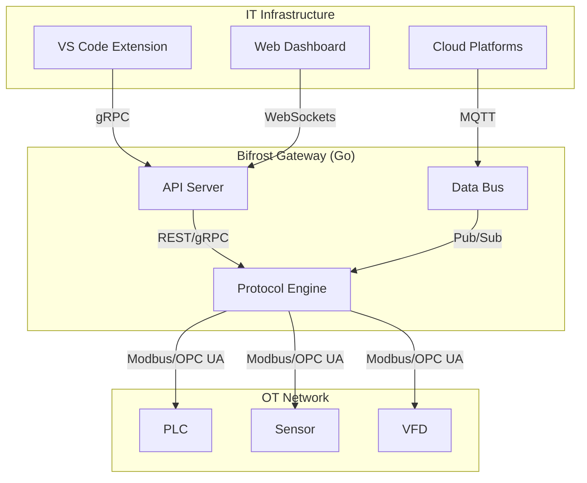
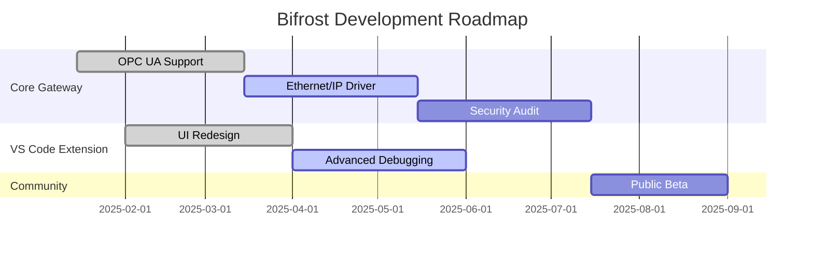

# 🌉 Bifrost - High-Performance Automation Software Engineering Support Tool

**Bifrost** is a high-performance industrial gateway built in Go that bridges OT equipment with modern IT infrastructure. This project is in its infancy and would benefit significantly from folks with expertise using it, finding does and does not work and helping us get a useful set of tools assembled.

## 🏆 Core Features

- **High-Performance Go Gateway**: Achieves 18,879 ops/sec with 53µs latency.
- **Protocol Support**: Native Modbus TCP/RTU (production ready), EtherNet/IP (in progress), with comprehensive fieldbus support planned (EtherCAT, BACnet, ProfiNet).
- **Modern IT Integration**: RESTful APIs, WebSocket streaming, and Prometheus metrics.
- **Cross-Platform**: Single binary deployment for Windows, Linux, and macOS.
- **VS Code Extension**: Enhances development with real-time monitoring and debugging.

## 💡 Architecture

The new architecture enhances performance and scalability by separating the Go-based gateway from the TypeScript-based VS Code extension. This design ensures that the core gateway remains lightweight and efficient, while the frontend provides a rich user experience.



## roadmap

Our development roadmap is focused on expanding protocol support, enhancing the VS Code extension, and strengthening security. The following diagram outlines our key milestones for the next 12 months.



## 🚀 Getting Started

1. **Run the Gateway**:

   ```bash
   go run ./cmd/gateway
   ```

1. **Install the VS Code Extension**:

   - Open the Extensions view in VS Code.
   - Search for "Bifrost" and click "Install."

1. **Connect to a Device**:

   - Open the Bifrost extension.
   - Add a new device and enter its IP address.

## 📚 Documentation

- **[Development Roadmap](docs/bifrost_dev_roadmap.md)**: Complete development timeline and current status
- **[Protocol Implementation Plan](docs/FIELDBUS_PROTOCOLS_IMPLEMENTATION_PLAN.md)**: Comprehensive plan for EtherCAT, BACnet, and ProfiNet support
- **[Protocol Integration Guide](docs/FIELDBUS_PROTOCOL_INTEGRATION_GUIDE.md)**: Technical guide for implementing new protocol handlers
- **[Technical Specification](docs/bifrost_spec.md)**: Detailed architecture and API documentation

## 🤝 Contributing

We welcome contributions from the community. Please read our [contributing guidelines](CONTRIBUTING.md) to get started.

______________________________________________________________________

*Expect more from your machines* 🌉
