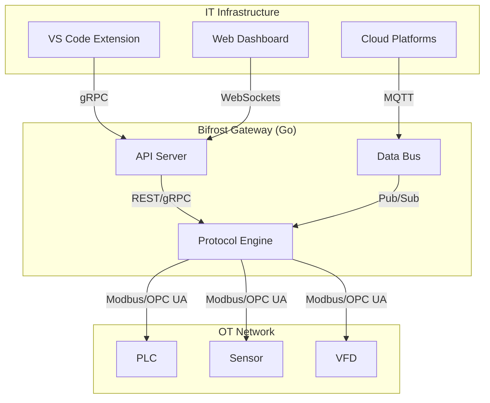
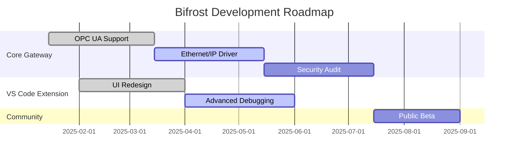

# 🌉 Bifrost - High-Performance Automation Software Engineering Support Tool

**Bifrost** is a high-performance industrial gateway built in Go that bridges OT equipment with modern IT infrastructure. This project is in its infancy and would benefit significantly from folks with expertise using it, finding does and does not work and helping us get a useful set of tools assembled.

## 🏆 Core Features

- **High-Performance Go Gateway**: Achieves 18,879 ops/sec with 53µs latency.
- **Protocol Support**: Native Modbus TCP/RTU, with OPC UA and others in development.
- **Modern IT Integration**: RESTful APIs, WebSocket streaming, and Prometheus metrics.
- **Cross-Platform**: Single binary deployment for Windows, Linux, and macOS.
- **VS Code Extension**: Enhances development with real-time monitoring and debugging.

## 💡 Architecture

The new architecture enhances performance and scalability by separating the Go-based gateway from the TypeScript-based VS Code extension. This design ensures that the core gateway remains lightweight and efficient, while the frontend provides a rich user experience.



## roadmap

Our development roadmap is focused on expanding protocol support, enhancing the VS Code extension, and strengthening security. The following diagram outlines our key milestones for the next 12 months.



## 🚀 Getting Started

1. **Run the Gateway**:

   ```bash
   go run ./cmd/gateway
   ```

1. **Install the VS Code Extension**:

   - Open the Extensions view in VS Code.
   - Search for "Bifrost" and click "Install."

1. **Connect to a Device**:

   - Open the Bifrost extension.
   - Add a new device and enter its IP address.

## 🏗️ Building Bifrost from Source

This section provides instructions for developers who want to build Bifrost components from the source code.

### Bazel Builds

Several Bifrost components are built using the Bazel build system. Ensure you have Bazel installed on your system. All Bazel commands should typically be run from the root of the repository.

#### Go Gateway

The Go Gateway is the core component of Bifrost.

**Using Bazel (Recommended):**

To build the Go Gateway using Bazel, run the following command from the root of the repository:

```bash
bazel build //go-gateway:bifrost-gateway
```

Or, you can use the direct target name:

```bash
bazel build //go-gateway:gateway
```

This will produce a binary typically located at `bazel-bin/go-gateway/gateway` (the exact path might vary slightly based on your operating system and architecture, e.g., `bazel-bin/go-gateway/gateway_/gateway` or `bazel-bin/go-gateway/gateway.exe`).

**Using Go Build (via Makefile):**

Alternatively, you can build the Go Gateway using the provided Makefile within the `go-gateway` directory:

```bash
cd go-gateway
make build
```

This will place the compiled binary in `go-gateway/bin/bifrost-gateway`. The Makefile also provides other useful targets like `make build-all` for cross-platform builds. Refer to `go-gateway/Makefile` for more details.

#### GUI (Graphical User Interface)

The Bifrost GUI provides a visual interface for interacting with the gateway. It consists of a Python backend and a React-based frontend.

**Backend (Bazel):**

To build the GUI backend server using Bazel, run the following command from the root of the repository:

```bash
bazel build //gui:server
```
This target is an alias for `//gui/backend:bifrost_gui_server`. The compiled output will be located within the `bazel-bin/` directory (e.g., `bazel-bin/gui/backend/bifrost_gui_server`).

**Frontend (Bazel - Source Files Only):**

The Bazel configuration for the React frontend currently makes the source files available as a `filegroup` but does not yet perform a full compilation or bundling process. You can "build" this filegroup using:

```bash
bazel build //gui/frontend:bifrost_gui_frontend_sources
```
This command ensures that the frontend source files are recognized by Bazel but does not produce a bundled web application.

**Frontend (Node.js - Manual Steps):**

To actually build the frontend assets for development or deployment, you would typically use Node.js and npm/yarn. The necessary build scripts in `gui/frontend/package.json` are marked as TODO. Once implemented, the process would look something like this (from the `gui/frontend/` directory):

```bash
cd gui/frontend
npm install  # or yarn install
npm run build # or yarn build (assuming 'build' script is defined in package.json)
```
This would compile the React application into static assets (e.g., in a `build` or `dist` folder within `gui/frontend/`). Refer to `gui/frontend/README.md` or `gui/frontend/package.json` for future updates on this process.

#### Legacy Python Packages (bifrost & bifrost-core)

**Note:** The Python packages `bifrost` and `bifrost-core` are considered legacy and have been superseded by the Go Gateway for core functionality. The following instructions apply to building any Bazel-managed components that were part of these legacy packages, primarily the native Rust extensions.

**Native Rust Extension (for legacy `bifrost` package):**

The legacy `bifrost` Python package included a native Rust component for performance-critical operations. To build this Rust shared library (which can be imported by Python) using Bazel, run:

```bash
bazel build //packages/bifrost/native:bifrost_native_py
```

This command builds the `librust_bifrost_native.so` (or equivalent `.dylib`/`.dll`) and the Python wrapper. The outputs will be located within the `bazel-bin/packages/bifrost/native/` directory.

The pure Python parts of the legacy `bifrost` and `bifrost-core` packages do not have dedicated top-level Bazel build targets. They were typically installed using standard Python packaging tools (like `pip`) when these packages were actively maintained.

### VSCode Extension

The Bifrost VSCode extension enhances the development experience with real-time monitoring, device discovery, and more. It is built using TypeScript and interacts with the Go Gateway.

**Prerequisites:**

*   Node.js (version 18.x or higher recommended)
*   npm (comes with Node.js)
*   Visual Studio Code

**Build Steps:**

1.  **Navigate to the extension directory:**
    ```bash
    cd vscode-extension
    ```

2.  **Install dependencies:**
    This will download all the necessary Node.js packages defined in `package.json`.
    ```bash
    npm install
    ```

3.  **Compile the TypeScript code:**
    The project uses `tsgo`, an experimental TypeScript to Go compiler by Microsoft, for potentially faster builds (as configured in `package.json`'s `compile` script).
    ```bash
    npm run compile
    ```
    This will generate the JavaScript output in the `out` directory within `vscode-extension/`.

**Installation:**

There are two primary ways to install the extension: for development or by packaging it into a `.vsix` file.

**1. Development Installation:**

This method installs the extension directly from your local build, which is useful for testing and development.

*   After completing the build steps above, ensure you are still in the `vscode-extension/` directory.
*   Run the following VS Code command-line interface command:
    ```bash
    code --install-extension .
    ```
*   Restart VS Code if prompted. The "Bifrost Industrial IoT" extension should now be available.

**2. Packaging and Installing a `.vsix` file (for distribution or sharing):**

This method packages the extension into a `.vsix` file, which is the standard format for distributing VS Code extensions.

*   **Install `vsce` (VS Code Extension Manager):**
    If you don't have it already, install `vsce` globally using npm:
    ```bash
    npm install -g @vscode/vsce
    ```

*   **Package the extension:**
    Ensure you are in the `vscode-extension/` directory and have successfully run `npm run compile`. Then, run:
    ```bash
    vsce package
    ```
    This will create a file named `bifrost-[version].vsix` (e.g., `bifrost-0.1.0.vsix`) in the `vscode-extension/` directory.

*   **Install the `.vsix` file in VS Code:**
    1.  Open VS Code.
    2.  Go to the Extensions view (Ctrl+Shift+X or Cmd+Shift+X).
    3.  Click the "..." (More Actions) menu in the top-right corner of the Extensions view.
    4.  Select "Install from VSIX..."
    5.  Browse to and select the `.vsix` file you created.
    6.  Restart VS Code if prompted.

## 🤝 Contributing

We welcome contributions from the community. Please read our [contributing guidelines](CONTRIBUTING.md) to get started.

______________________________________________________________________

*Expect more from your machines* 🌉
