# Bifrost Gateway Specification

## High-Performance Go-Based Industrial Gateway

### Version: 2.0.0

### Date: July 2025

______________________________________________________________________

## 1. Executive Summary

Bifrost is a high-performance industrial gateway built in Go that bridges the gap between Operational Technology (OT) equipment and modern IT infrastructure. It provides production-ready tools for industrial communication, addressing critical needs in PLC communication, real-time data streaming, and cloud integration with proven performance improvements.

### Core Value Propositions

- **Performance**: Native Go implementation achieving 18,879 ops/sec with 53µs latency
- **Single Binary Deployment**: No runtime dependencies, easy production deployment
- **Production-Ready**: Proven reliability, security, and scalability in industrial environments
- **Developer-Friendly**: RESTful APIs with comprehensive documentation and VS Code integration

______________________________________________________________________

## 2. Architecture Overview

### 2.1 Core Design Principles

- **High-Performance Native Code**: Go's compiled performance for critical paths
- **Single Binary Deployment**: No runtime dependencies for production environments
- **Concurrent by Default**: Built on Go's goroutines and channels for scalability
- **Type Safety**: Go's compile-time type checking and interface contracts
- **RESTful API Design**: HTTP-based APIs for cross-platform integration

### 2.2 System Architecture

```mermaid
graph LR
    A["🖥️ TypeScript Frontend<br/>VS Code Extension<br/>Real-time Monitoring"] <-->|"REST API<br/>WebSocket"| B["⚡ Go Gateway<br/>High-Performance Core<br/>18,879 ops/sec"]
    B <-->|"Industrial Protocols<br/>Modbus TCP/RTU<br/>Ethernet/IP<br/>OPC-UA"| C["🏭 Industrial Devices<br/>PLCs & Controllers<br/>SCADA Systems"]
    
    classDef frontend fill:#e1f5fe,stroke:#0277bd,stroke-width:2px,color:#000
    classDef gateway fill:#f3e5f5,stroke:#7b1fa2,stroke-width:2px,color:#000
    classDef devices fill:#e8f5e8,stroke:#388e3c,stroke-width:2px,color:#000
    
    class A frontend
    class B gateway
    class C devices
```



### 2.3 Component Structure


______________________________________________________________________

## 3. Detailed Architecture Diagrams

For detailed technical diagrams, see the [diagrams directory](./diagrams/):

### Component Architecture
- **[Gateway Components](./diagrams/architecture/gateway-components.puml)** - Detailed Go gateway internal structure
- **[Protocol Handler Interface](./diagrams/architecture/gateway-components.puml)** - Unified protocol abstraction

### API Interactions  
- **[Modbus Read Sequence](./diagrams/sequences/modbus-read-sequence.puml)** - Complete Modbus read operation flow
- **[WebSocket Streaming](./diagrams/sequences/)** - Real-time data streaming architecture

### Deployment Architecture
- **[Production Deployment](./diagrams/deployment/production-deployment.puml)** - Complete production environment setup
- **[Cloud Integration](./diagrams/deployment/)** - Cloud platform integration patterns

> **Note**: PlantUML diagrams can be viewed in VS Code with the PlantUML extension or online at [plantuml.com](http://www.plantuml.com/plantuml/uml/)

______________________________________________________________________

## 4. Component Specifications

### 4.1 Go Gateway Core (`go-gateway/`)

#### Features

- **High-Performance Implementation**: Native Go with proven 18,879 ops/sec throughput
- **Production Ready**: Comprehensive error handling, logging, and monitoring
- **Protocol Support**: Modbus TCP/RTU with unified API for additional protocols
- **Concurrent Architecture**: Goroutine-based concurrent device management

#### REST API Example

```bash
# Device Management
curl -X GET http://localhost:8080/api/devices
curl -X POST http://localhost:8080/api/devices/discover \
     -d '{"network_range": "192.168.1.0/24"}'

# Data Operations  
curl -X GET http://localhost:8080/api/tags/read \
     -d '{"device_id": "plc-001", "tag_ids": ["temp1", "pressure"]}'
curl -X POST http://localhost:8080/api/tags/write \
     -d '{"device_id": "plc-001", "tag_id": "setpoint", "value": 75.5}'

# Real-time WebSocket streaming
wscat -c ws://localhost:8080/ws
```

### 4.2 Protocol Handler System (`internal/protocols/`)

#### Supported Protocols

**Production Ready**:

- **Modbus TCP/RTU**: Full implementation with connection pooling (53µs latency)
  - Multiple register reads/writes
  - Automatic reconnection and error handling
  - Performance optimized for industrial edge deployment
  - Comprehensive device discovery and diagnostics

**In Development**:

- **OPC UA**: Native Go implementation or CGO wrapper planned
- **Ethernet/IP (CIP)**: Native Go implementation in progress
- **S7 (Siemens)**: Future protocol support planned

**Extensible Architecture**:

- Unified ProtocolHandler interface for all protocols
- Plugin architecture for custom protocol implementations
- Protocol-specific optimizations and features

#### Protocol Handler Interface

```go
type ProtocolHandler interface {
    // Connection management
    Connect(device *Device) error
    Disconnect(device *Device) error
    IsConnected(device *Device) bool
    
    // Data operations
    ReadTag(device *Device, tag *Tag) (interface{}, error)
    WriteTag(device *Device, tag *Tag, value interface{}) error
    ReadMultipleTags(device *Device, tags []*Tag) (map[string]interface{}, error)
    
    // Device discovery and information
    DiscoverDevices(ctx context.Context, networkRange string) ([]*Device, error)
    GetDeviceInfo(device *Device) (*DeviceInfo, error)
    
    // Health and diagnostics
    Ping(device *Device) error
    GetDiagnostics(device *Device) (*Diagnostics, error)
}
```

### 3.3 VS Code Extension (`vscode-extension/`)

#### Core Capabilities

**Current Features (Production Ready)**:

- **TypeScript-Go Integration**: 10x faster compilation than standard TypeScript
- **Device Management**: Tree view with live status indicators for connected devices
- **Real-time Monitoring**: WebSocket-based live data visualization with sub-second updates
- **Gateway Integration**: Seamless connection to Go gateway via REST API and WebSocket
- **Industrial UI**: Professional interface optimized for control room environments

**Development Features**:

- **Protocol Debugging**: Industrial protocol-specific debugging tools
- **Performance Monitoring**: Real-time display of gateway performance metrics
- **Device Discovery**: Automatic discovery and configuration of industrial devices
- **Data Operations**: Read/write operations with batch support
- **Error Handling**: Comprehensive error tracking and troubleshooting

#### Extension Features

```typescript
// Device Management Provider
export class DeviceProvider implements vscode.TreeDataProvider<DeviceItem> {
    private gateway: GatewayClient;
    
    constructor() {
        this.gateway = new GatewayClient('http://localhost:8080');
    }
    
    async getChildren(element?: DeviceItem): Promise<DeviceItem[]> {
        if (!element) {
            // Root level - show connected devices
            const devices = await this.gateway.getDevices();
            return devices.map(device => new DeviceItem(device));
        } else {
            // Show device tags
            const tags = await this.gateway.getDeviceTags(element.device.id);
            return tags.map(tag => new TagItem(tag));
        }
    }
}

// Real-time data streaming
const ws = new WebSocket('ws://localhost:8080/ws');
ws.onmessage = (event) => {
    const data = JSON.parse(event.data);
    if (data.type === 'tag_update') {
        updateDataView(data.device_id, data.tag);
    }
};
```

### 3.4 Virtual Device Testing Framework (`virtual-devices/`)

#### Testing Components

**Device Simulators (Production Ready)**:

- **Modbus TCP/RTU Simulators**: Full protocol implementation with realistic behavior
- **OPC UA Simulators**: Complete server implementation for testing
- **Network Simulation**: Configurable latency, packet loss, and bandwidth limiting
- **Industrial Scenarios**: Factory floor, process control, and SCADA testing environments

**Performance Testing**:

- **Benchmarking Suite**: Comprehensive performance validation tools
- **Load Testing**: Support for 1000+ concurrent device connections
- **Stress Testing**: Network condition simulation and fault injection
- **Regression Testing**: Automated performance regression detection

**Testing Infrastructure**:

- **Docker Compose**: Orchestrated multi-device testing environments
- **Kubernetes**: Scalable testing in cloud environments
- **CI/CD Integration**: Automated testing in GitHub Actions
- **Performance Monitoring**: Real-time performance metrics during testing

#### Simulator Features

```bash
# Start Modbus TCP simulator
cd virtual-devices/simulators/modbus
python modbus_server.py --port 502 --slave-id 1

# Configure dynamic data simulation
{
  "registers": {
    "40001": {"type": "temperature", "range": [20, 80], "unit": "°C"},
    "40003": {"type": "pressure", "range": [0, 100], "unit": "PSI"},
    "40005": {"type": "flow_rate", "range": [0, 500], "unit": "GPM"}
  },
  "update_interval": 1000,
  "noise_level": 0.1
}

# Network condition simulation
python network_simulator.py --latency 50ms --packet-loss 1% --bandwidth 1Mbps
```

#### Performance Validation

```go
// Benchmark Results (from actual testing)
func BenchmarkModbusRead(b *testing.B) {
    // Sequential: 18,879 ops/sec, 53µs avg latency
    // Concurrent: 12,119 ops/sec with 10 goroutines
    // Success Rate: 100% (1000/1000 operations)
}
```

______________________________________________________________________

## 4. Technical Requirements

### 4.1 Performance Achieved

Based on comprehensive testing with production hardware (documented in `go-gateway/TEST_RESULTS.md`):

**Modbus TCP Performance**:

- **Throughput**: 18,879 operations/second (sequential operations)
- **Latency**: 53µs average response time (EXCEEDED TARGET: <1ms)
- **Concurrent Performance**: 12,119 ops/sec with 10 concurrent goroutines
- **Success Rate**: 100% (1000/1000 operations successful)
- **Memory Usage**: < 50MB base footprint (EXCEEDED TARGET: <100MB)

**System Performance**:

- **Binary Size**: ~15MB single binary deployment
- **Startup Time**: Sub-second initialization
- **Connection Pooling**: 1000+ simultaneous device connections
- **Network Throughput**: Optimized for industrial edge deployment

**Benchmarking Results**:

- **Address Validation**: 33.6M operations/second
- **Data Conversion**: 2.9B operations/second
- **Device Operations**: 100 devices processed in 51µs
- **WebSocket Streaming**: Real-time data updates with <10ms latency

**Test Environment**:

- **Hardware**: Development machine (macOS Darwin 24.5.0)
- **Go Version**: 1.22+ with native compilation
- **Network**: Local loopback testing with realistic conditions
- **Testing Framework**: Comprehensive virtual device simulators

### 4.2 Platform Support

- **Go**: 1.22+ (leveraging latest performance improvements)
- **Operating Systems**: Linux (primary), Windows, macOS
- **Architectures**: x86_64, ARM64 (including Raspberry Pi)
- **Deployment**: Single binary, Docker containers, systemd services

### 4.3 Dependencies

**Go Gateway (Minimal Dependencies)**:

- **Core Go**: Standard library (net, context, sync, encoding/json, log/slog)
- **External Dependencies**:
  - `gorilla/websocket`: WebSocket support (BSD-3-Clause)
  - `prometheus/client_golang`: Metrics collection (Apache 2.0)
  - `go.uber.org/zap`: High-performance logging (MIT)

**VS Code Extension**:

- **TypeScript-Go**: Microsoft's experimental compiler for 10x faster builds
- **VS Code APIs**: Native extension integration
- **WebSocket Client**: Real-time communication with gateway

**Virtual Device Testing**:

- **Python**: Simulator implementations with realistic device behavior
- **Docker**: Containerized testing environments
- **Network Tools**: Latency and packet loss simulation

**Build System**:

- **Go Modules**: Native dependency management
- **Bazel**: Multi-language build system (optional)
- **GitHub Actions**: Automated CI/CD with cross-platform builds
- **Just**: Task runner for development workflows

______________________________________________________________________

## 5. Security Considerations

- **TLS/SSL**: HTTPS endpoints with proper certificate validation
- **Input Validation**: Comprehensive request validation and sanitization
- **Authentication**: Token-based authentication for production deployments
- **Network Security**: Configurable firewall rules and access controls
- **Audit Logging**: Structured logging for security events and compliance

______________________________________________________________________

## 6. Deployment Scenarios

### 6.1 Edge Gateway

- Single binary deployment on industrial PC or gateway device
- Collect data from multiple PLCs via unified REST API
- Real-time WebSocket streaming for monitoring applications
- Prometheus metrics for production monitoring

### 6.2 Industrial IoT Hub

- Central gateway serving multiple applications
- RESTful API for integration with MES, ERP, and analytics platforms
- Container deployment for cloud and Kubernetes environments
- Horizontal scaling for high-throughput scenarios

### 6.3 Development Environment

- VS Code extension for industrial automation development
- Local gateway for device testing and protocol debugging
- TypeScript-Go integration for faster development cycles
- Virtual device framework for comprehensive testing

______________________________________________________________________

## 7. Gateway Management and Monitoring

### 7.1 Production Deployment

- **Binary Distribution**: Single 15MB binary with no runtime dependencies
- **Configuration**: YAML-based configuration with environment variable overrides
- **Process Management**: systemd service integration and graceful shutdown
- **Container Support**: Docker images for cloud and Kubernetes deployment

### 7.2 Monitoring and Observability

#### REST API Endpoints

```bash
# Health and status
GET /health                         # Health check endpoint
GET /metrics                        # Prometheus metrics

# Device management
GET /api/devices                    # List connected devices
POST /api/devices/discover          # Network device discovery
GET /api/devices/{id}/info          # Device information and diagnostics

# Data operations
GET /api/tags/read                  # Read tag values
POST /api/tags/write                # Write tag values
WS /ws                              # Real-time WebSocket streaming
```

#### Prometheus Metrics

```bash
# Performance metrics
bifrost_connections_total           # Total device connections
bifrost_data_points_processed_total # Data points processed
bifrost_errors_total               # Total errors encountered  
bifrost_response_time_seconds      # Response time histogram

# Example metrics output
# TYPE bifrost_connections_total counter
bifrost_connections_total{protocol="modbus-tcp"} 15
# TYPE bifrost_response_time_seconds histogram
bifrost_response_time_seconds_bucket{le="0.001"} 8542  # Sub-1ms responses
```

#### Structured Logging

```json
{
  "timestamp": "2025-07-07T10:30:45Z",
  "level": "info",
  "msg": "Device connected successfully",
  "device_id": "plc-001",
  "protocol": "modbus-tcp",
  "address": "192.168.1.100:502",
  "latency_ms": 0.053,
  "tags_discovered": 47
}
```

### 7.3 VS Code Extension Integration

#### Real-time Device Monitoring

- Device tree view with live status indicators
- Tag value monitoring with real-time updates
- Protocol-specific debugging tools
- Network discovery and device management

#### Development Features

- TypeScript-Go compilation (10x faster than standard TypeScript)
- Industrial protocol IntelliSense and code completion
- Integrated testing with virtual device framework
- Gateway connection management

## 8. API Design Philosophy

- **REST-First**: Clean HTTP APIs for cross-platform integration
- **Real-time Capable**: WebSocket streaming for live data monitoring
- **Type Safe**: Go's compile-time type checking and interface contracts
- **Resource Efficient**: Connection pooling and optimized memory usage
- **Production Ready**: Comprehensive error handling and monitoring integration
