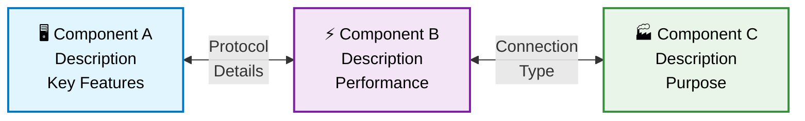
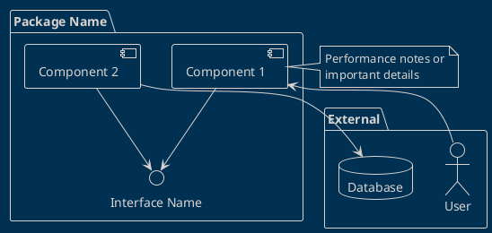
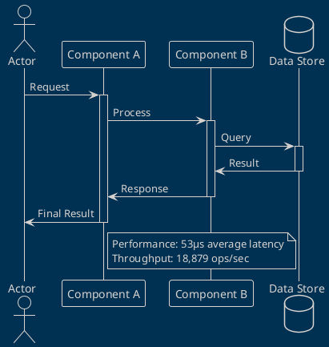
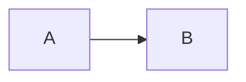

# Bifrost Diagram Standards

This document defines the standards and templates for creating diagrams in the Bifrost project.

## Diagram Types and Tools

| Diagram Type | Tool | File Extension | Use Case |
|--------------|------|----------------|----------|
| System Architecture | Mermaid | `.md` (inline) | High-level system overviews |
| Component Details | PlantUML | `.puml` | Detailed component relationships |
| Sequence Diagrams | PlantUML | `.puml` | API interactions, protocol flows |
| Deployment | PlantUML | `.puml` | Production environment setup |
| Industrial Protocols | PlantUML | `.puml` | P&ID, ladder logic concepts |

## Mermaid Standards

### Colors and Styling

Use the Bifrost color scheme:
```mermaid
classDef frontend fill:#e1f5fe,stroke:#0277bd,stroke-width:2px,color:#000
classDef gateway fill:#f3e5f5,stroke:#7b1fa2,stroke-width:2px,color:#000
classDef devices fill:#e8f5e8,stroke:#388e3c,stroke-width:2px,color:#000
classDef cloud fill:#fff3e0,stroke:#f57c00,stroke-width:2px,color:#000
```

### Icon Usage

Use appropriate emojis for visual clarity:
- 🖥️ Frontend/UI components
- ⚡ High-performance components
- 🏭 Industrial devices
- ☁️ Cloud services
- 🔧 Configuration/tools
- 📊 Monitoring/metrics

### Template: System Architecture



## PlantUML Standards

### Theme and Styling

Always use the blueprint theme:
```plantuml
@startuml
!theme blueprint
' Your diagram content here
@enduml
```

### Component Diagram Template



### Sequence Diagram Template



### Deployment Diagram Template

```plantuml
@startuml Deployment Template
!theme blueprint

!define ICONURL https://raw.githubusercontent.com/tupadr3/plantuml-icon-font-sprites/v2.4.0
!includeurl ICONURL/devicons2/go.puml
!includeurl ICONURL/devicons2/docker.puml

node "Server Name" as server {
  component "<$go>\nGo Application" as app
  component "<$docker>\nDocker Container" as container
}

cloud "Cloud Platform" as cloud {
  component [Service 1] as svc1
  component [Service 2] as svc2
}

app --> svc1 : Protocol
app --> svc2 : Protocol

@enduml
```

## File Organization

```
docs/diagrams/
├── README.md
├── STANDARDS.md (this file)
├── templates/
│   ├── mermaid-template.md
│   ├── component-template.puml
│   ├── sequence-template.puml
│   └── deployment-template.puml
├── architecture/
│   ├── system-overview.puml
│   ├── gateway-components.puml
│   └── protocol-architecture.puml
├── sequences/
│   ├── modbus-read-sequence.puml
│   ├── websocket-streaming.puml
│   └── device-discovery.puml
├── deployment/
│   ├── production-deployment.puml
│   ├── cloud-integration.puml
│   └── edge-deployment.puml
└── exports/
    ├── svg/
    ├── png/
    └── pdf/
```

## Naming Conventions

### File Names
- Use kebab-case: `modbus-read-sequence.puml`
- Be descriptive: `production-deployment.puml` not `deploy.puml`
- Include diagram type: `gateway-components.puml`, `api-sequence.puml`

### Diagram Elements
- **Components**: Use descriptive names with technology
- **Interfaces**: Clearly indicate the protocol or API
- **Notes**: Include performance metrics when relevant
- **Actors**: Use role-based names (Developer, Engineer, System)

## Performance Annotations

Always include relevant performance metrics in diagrams:

```plantuml
note right of gateway
  **Performance Metrics**
  - 18,879 ops/sec throughput
  - 53µs average latency
  - < 50MB memory footprint
  - 1000+ concurrent connections
end note
```

## Review Checklist

Before committing diagrams, ensure:

- [ ] Correct theme applied (blueprint for PlantUML)
- [ ] Consistent color scheme used
- [ ] Performance metrics included where relevant
- [ ] Clear, descriptive component names
- [ ] Proper file naming convention
- [ ] Diagram exports to SVG format
- [ ] Documentation updated with new diagrams

## VS Code Usage

### Recommended Extensions
- PlantUML (jebbs.plantuml)
- Markdown Mermaid (bierner.markdown-mermaid)
- Markdown Preview Enhanced (shd101wyy.markdown-preview-enhanced)

### Preview Commands
- **PlantUML**: `Ctrl+Shift+P` → "PlantUML: Preview Current Diagram"
- **Mermaid**: `Ctrl+Shift+P` → "Markdown Preview Enhanced: Open Preview"

### Export Commands
- **PlantUML**: `Ctrl+Shift+P` → "PlantUML: Export Current Diagram"
- **Mermaid**: Use Markdown Preview Enhanced export features

## Integration with Documentation

### Embedding in Markdown

**Mermaid** (inline):
```markdown

```

**PlantUML** (reference):
```markdown

```

### GitHub Rendering

- Mermaid diagrams render natively in GitHub
- PlantUML diagrams require export to SVG/PNG for GitHub viewing
- Always provide both .puml source and exported images

## Maintenance

- Review diagrams quarterly for accuracy
- Update performance metrics when benchmarks change
- Regenerate exports when source diagrams are modified
- Archive outdated diagrams to `docs/diagrams/archived/`