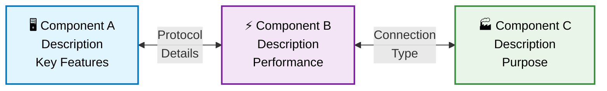
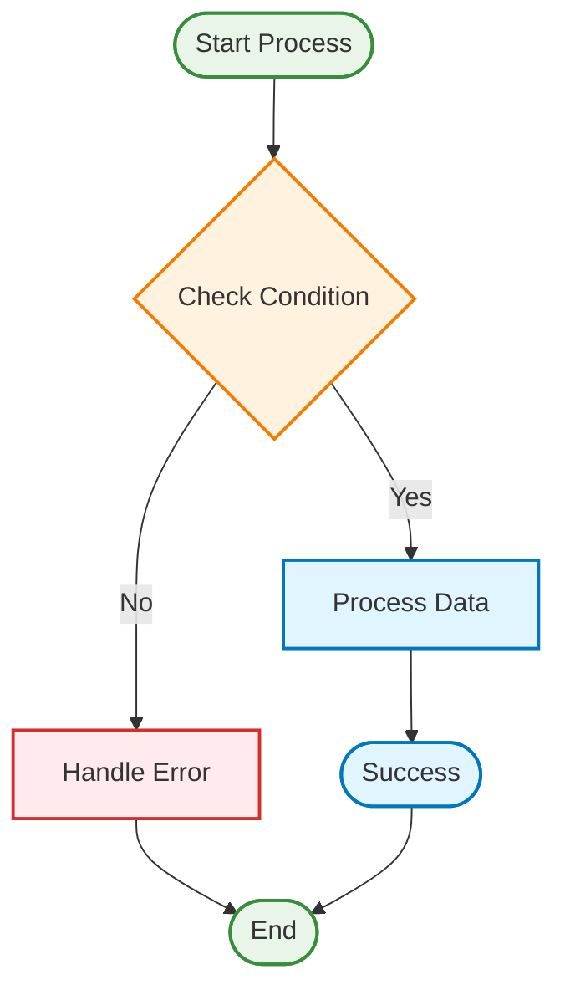
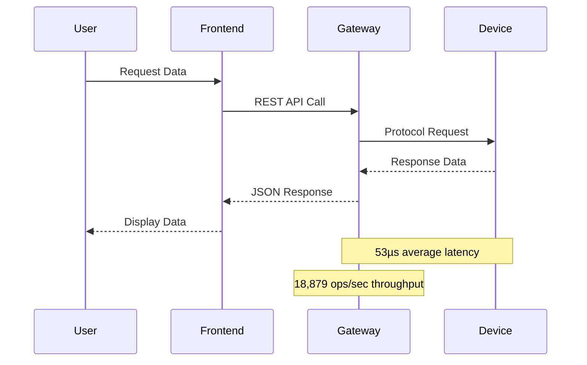
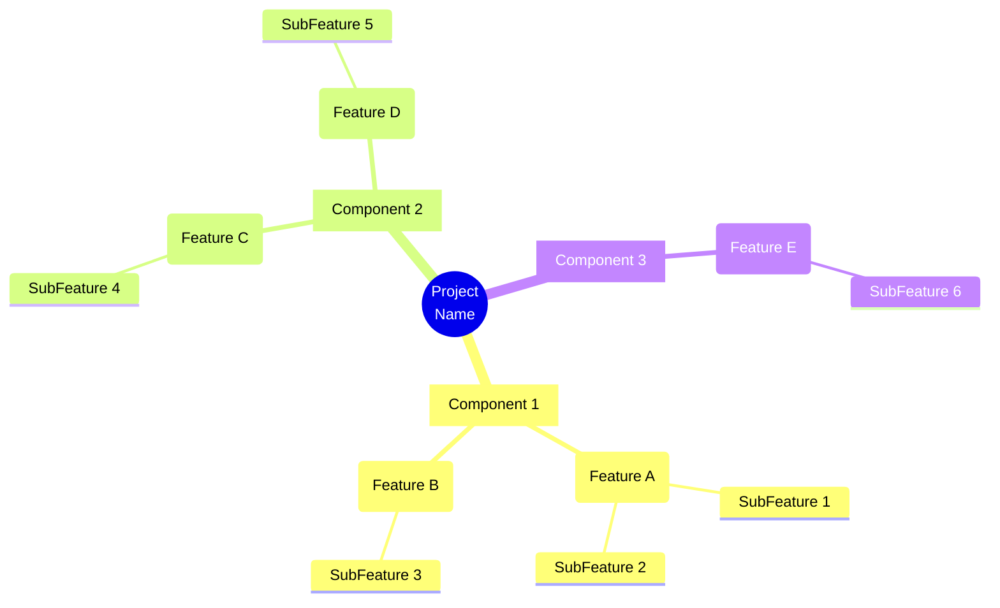

# Mermaid Template

## System Architecture Template

```mermaid
graph LR
    A["🖥️ Component A<br/>Description<br/>Key Features"] <-->|"Protocol<br/>Details"| B["⚡ Component B<br/>Description<br/>Performance"]
    B <-->|"Connection<br/>Type"| C["🏭 Component C<br/>Description<br/>Purpose"]
    
    classDef frontend fill:#e1f5fe,stroke:#0277bd,stroke-width:2px,color:#000
    classDef gateway fill:#f3e5f5,stroke:#7b1fa2,stroke-width:2px,color:#000
    classDef devices fill:#e8f5e8,stroke:#388e3c,stroke-width:2px,color:#000
    
    class A frontend
    class B gateway
    class C devices
```

## Flowchart Template

```mermaid
flowchart TD
    Start([Start Process]) --> Check{Check Condition}
    Check -->|Yes| Process[Process Data]
    Check -->|No| Error[Handle Error]
    Process --> Success([Success])
    Error --> End([End])
    Success --> End
    
    classDef startEnd fill:#e8f5e8,stroke:#388e3c,stroke-width:2px
    classDef process fill:#e1f5fe,stroke:#0277bd,stroke-width:2px
    classDef decision fill:#fff3e0,stroke:#f57c00,stroke-width:2px
    classDef error fill:#ffebee,stroke:#d32f2f,stroke-width:2px
    
    class Start,End startEnd
    class Process,Success process
    class Check decision
    class Error error
```

## Sequence Diagram Template

```mermaid
sequenceDiagram
    participant User
    participant Frontend
    participant Gateway
    participant Device
    
    User->>Frontend: Request Data
    Frontend->>Gateway: REST API Call
    Gateway->>Device: Protocol Request
    Device-->>Gateway: Response Data
    Gateway-->>Frontend: JSON Response
    Frontend-->>User: Display Data
    
    Note over Gateway,Device: 53µs average latency
    Note over Gateway: 18,879 ops/sec throughput
```

## Mind Map Template

```mermaid
mindmap
  root((Project<br/>Name))
    [Component 1]
      (Feature A)
        SubFeature 1
        SubFeature 2
      (Feature B)
        SubFeature 3
    [Component 2]
      (Feature C)
        SubFeature 4
      (Feature D)
        SubFeature 5
    [Component 3]
      (Feature E)
        SubFeature 6
```